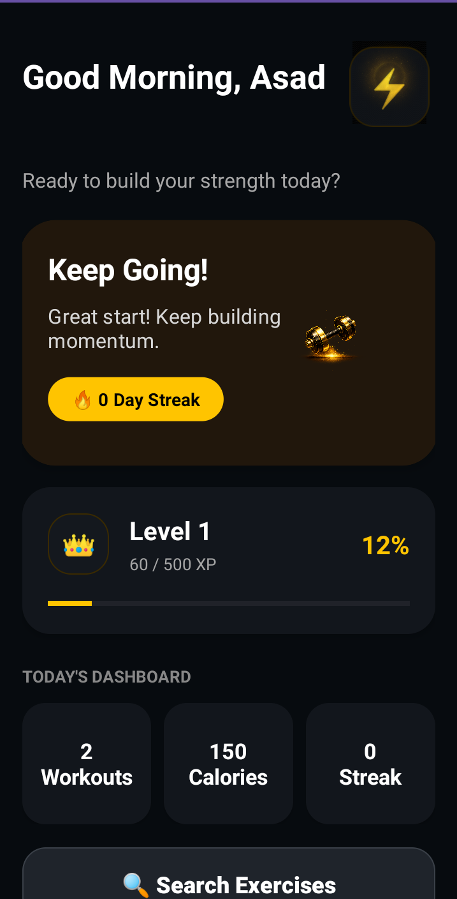
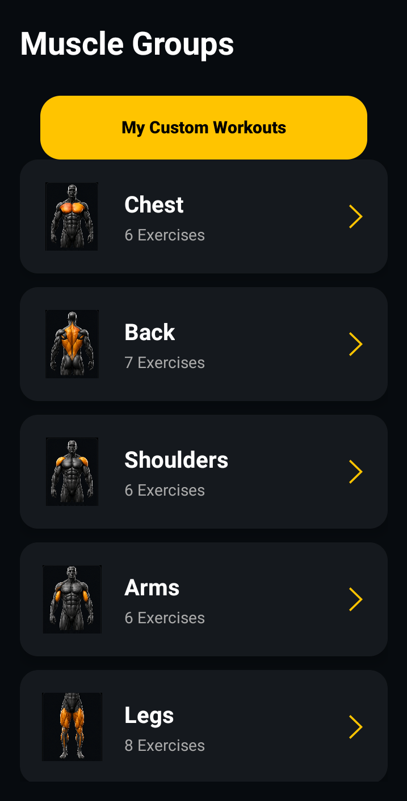
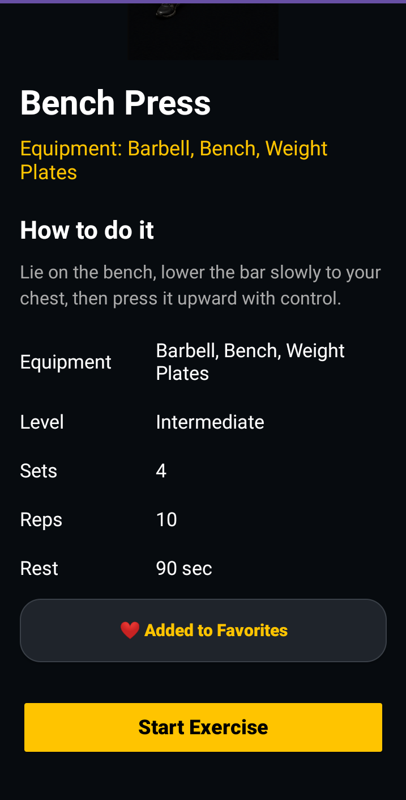
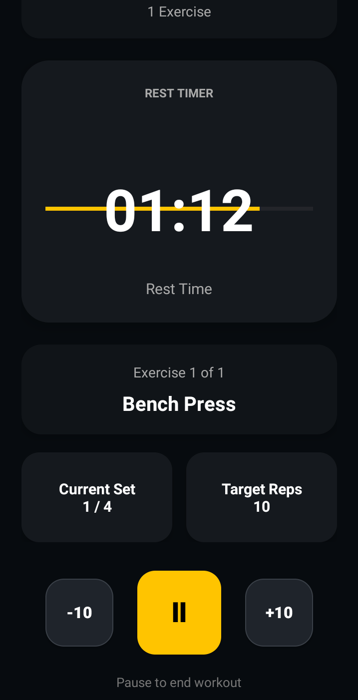

# BUILD FIT

### Professional Android Fitness Application

> A premium Android fitness application built with Java and XML to help users build healthier lifestyles through structured workouts, progress tracking, achievements, and a modern dark-themed interface.

---

# 📖 About BUILD FIT

BUILD FIT is a premium Android fitness application designed to help users build healthier lifestyles through structured workout programs, intelligent progress tracking, daily challenges, and achievement-based motivation. Developed using **Java** and **XML**, the application combines a modern dark-themed user interface with practical fitness tools to provide a smooth, engaging, and professional user experience.

Whether you're beginning your fitness journey or maintaining a consistent routine, BUILD FIT offers an organized and intuitive platform to track your workouts, monitor your progress, and stay motivated every day.

---

# ✨ Features

## 🏋️ Workout Experience

- Structured workout categories
- Muscle group selection
- Comprehensive exercise library
- Detailed exercise information
- Built-in workout timer
- Today's workout section

## 📊 Progress & Motivation

- XP & Level Progression System
- Workout history tracking
- Achievement & Badge System
- Daily Dashboard Statistics
- Daily Challenges
- Body Overview

## 🎨 User Experience

- Premium Dark Theme
- Professional Dashboard
- Dynamic Greeting Animation
- Hero Motivation Card
- Responsive Layout
- Smooth UI Animations
- Professional Bottom Navigation
- User Profile & Settings

---

# 📸 Application Preview

## 🏠 Dashboard

The dashboard serves as the central hub of the application, providing users with daily workout statistics, motivation, XP progression, quick navigation, and personalized fitness insights.

---

## 💪 Workout Categories

Users can browse organized workout categories and muscle groups, making it easy to select exercises based on specific fitness goals.

---

## 🏋️ Exercise Details

Each exercise contains detailed information, targeted muscle groups, execution guidance, and workout instructions for effective training.

---

## ⏱️ Workout Timer

The integrated workout timer allows users to accurately monitor exercise duration and rest intervals, improving workout efficiency.

---

# 🛠 Tech Stack

- Java
- XML
- Android Studio
- RecyclerView
- ConstraintLayout
- Material Components
- SharedPreferences
- ObjectAnimator
- ValueAnimator
- Vector Drawables
- Git
- GitHub

---

# 🏗 Architecture

BUILD FIT follows a traditional Android application architecture using Java and XML. The project is organized with dedicated Activities, Models, Adapters, utility classes, and reusable UI components to keep the codebase clean, modular, and maintainable while supporting future scalability.

---

# 📥 Installation

1. Clone this repository.
2. Open the project using Android Studio.
3. Allow Gradle to synchronize all dependencies.
4. Connect an Android device or launch an emulator.
5. Build and run the application.

---

# 📦 Download APK

Experience **BUILD FIT** without opening Android Studio.

Download the latest release APK and explore the application's premium interface, structured workout plans, progress tracking system, achievements, and interactive fitness experience directly on your Android device.

| Information | Details |
|-------------|---------|
| 📦 Version | v1.0 |
| 📱 Platform | Android |
| ⚙️ Minimum SDK | API 26 |
| 🛠 Built With | Java & XML |
| 📅 Release | July 2026 |

> **Note:** If Android displays a security warning during installation, enable **Install from Unknown Sources** for your browser or file manager, then continue the installation.

---

# 🚀 Future Roadmap

The BUILD FIT project is continuously evolving. Planned future enhancements include:

- 🤖 BuildFit Coach AI (Powered by OpenAI)
- 🏋️ AI Workout Generator
- 🥗 AI Nutrition Planner
- 💬 Personalized Fitness Coaching
- 📸 Body Progress Photos
- 🔥 Workout Analytics
- ☁️ Firebase Integration
- ☁️ Cloud Synchronization
- 🗄️ Room Database Migration
- 👥 Social Features
- 🏆 Leaderboards
- 💧 Water Intake Tracker
- 🔔 Push Notifications
- ⌚ Wear OS Support
- 🏃 Google Fit Integration

---

# 👨‍💻 Developer

## Asad Ali Khan

Computer Science Student • Android Developer • AI Application Developer

I am passionate about building high-quality Android applications that combine modern user interface design with intelligent functionality. My primary areas of interest include Android Development, Artificial Intelligence, Backend Development, and creating real-world software solutions that deliver meaningful user experiences.

### Connect With Me

- GitHub: https://github.com/Asad-KhanDev
- LinkedIn: https://www.linkedin.com/in/asad-ali-khan-b76325335
- Upwork: https://www.upwork.com/freelancers/~011be02e85d9578791

---

# ⭐ Support the Project

If you found BUILD FIT useful or inspiring, please consider giving this repository a ⭐. Your support helps motivate future improvements and the development of new features.

---

## 📄 License

This project is currently provided for portfolio and educational demonstration purposes.

© 2026 Asad Ali Khan. All Rights Reserved.
